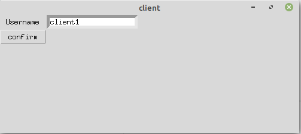
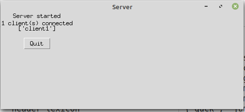
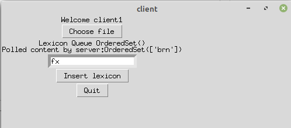
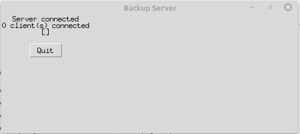
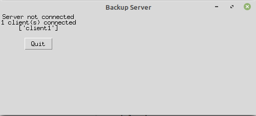
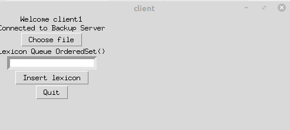
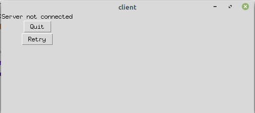

# Distributed System
## A client-server system for spell checking
Client registers with a username | 
-----|------
Server accepts if the username is not taken by other clients | 
Client uploads a text file to the server for spell checking against a lexicon of commonly misspelled words. Client can also add words to the server's lexicon. Server periodically polls each clients for new words in the lexicon | 

### Backup

Primary server connects to a backup server and pushes the lexicon periodically | 
-----|------
If primary server crashes, clients connect to this backup server | 
Normal operation goes on at the backup server until primary rejoins | 
If both primary and backup dies, error message is shown to client | 
